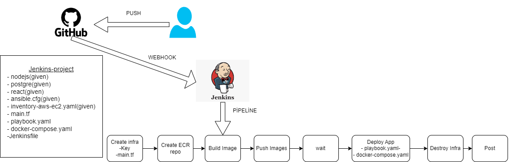

# MAİN.TF

## Provider Settings

- **AWS Provider:** Utilizes the Hashicorp AWS module with version `5.45.0`.
- **Region Configuration:** Configured to deploy resources in the AWS `us-east-1` region.

## Variables

- **Key Variable:** The `key` variable is set to `"jenkins-project"` and is used as the name for the SSH key pair for the EC2 instance.
- **User Variable:** The `user` variable is set to `"techpro"` which is used to determine user-specific configurations or contexts.

## EC2 Instance

- **Resource Type:** `aws_instance`
- **Instance Type:** `t2.micro`
- **AMI:** The AMI used is `"ami-0230bd60aa48260c6"`.
- **IAM Role:** Associated with a specific IAM role named `jenkins-project-profile-techpro`.
- **Tags:** The instance is tagged with a `Name` of `"jenkins_project"`.

## Security Group

- **Resource Name:** `aws_security_group` with the name `"project-jenkins-sec-gr"`.
- **Ingress Rules:**
  - Allows incoming connections on port 22 (SSH).
  - Allows incoming connections on port 5000 for web applications.
  - Allows incoming connections on port 3000 for additional web interfaces.
  - Allows incoming connections on port 5432 for PostgreSQL database access.
- **Egress Rules:**
  - Allows all outgoing traffic from any port to any destination (`0.0.0.0/0`).

## Outputs

- **Public IP:** The script outputs the public IP address of the created EC2 instance as `node_public_ip`.

# Playbook.yaml

## Update System Packages
- **Description:** Updates all packages on the system to their latest versions.
- **Command:** `sudo yum update -y`

## Remove Old Docker Versions
- **Description:** Removes old Docker packages installed from the CentOS repository.
- **Packages Removed:**
  - docker
  - docker-client
  - docker-client-latest
  - docker-common
  - docker-latest
  - docker-latest-logrotate
  - docker-logrotate
  - docker-engine

## Install Yum Utilities
- **Description:** Installs necessary utilities for managing packages.
- **Utilities Installed:**
  - yum-utils
  - device-mapper-persistent-data
  - lvm2
  - unzip

## Install Docker
- **Description:** Installs the latest version of Docker using yum.

## Add User to Docker Group
- **Description:** Adds the `ec2-user` to the Docker group to allow running Docker without 

## Start Docker Service
- **Description:** Starts and enables the Docker service to run on boot.

## Install Docker Compose
- **Description:** Downloads and installs Docker Compose.

## Log in to AWS ECR
- **Description:** Logs into AWS Elastic Container Registry using Docker.

## Copy docker-compose.yml to Server
- **Description:** Copies the local `docker-compose.yml` file to the server's `/home/ec2-user/` directory.

## Start Application with Docker Compose
- **Description:** Starts the application using Docker Compose in detached mode.

# docker-compose.yaml
env variables: 
- postgre container -->> POSTGRES_PASSWORD: Pp123456789
- react container -->> REACT_APP_BASE_URL: http://${NODE_IP}:5000/
- nodejs -->>
            SERVER_PORT: 5000
            DB_USER: postgres
            DB_PASSWORD: Pp123456789
            DB_NAME: techprotodo
            DB_HOST: todo_postgre
            DB_PORT: 5432

# Jenkinsfile